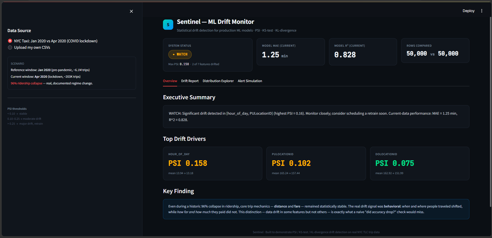
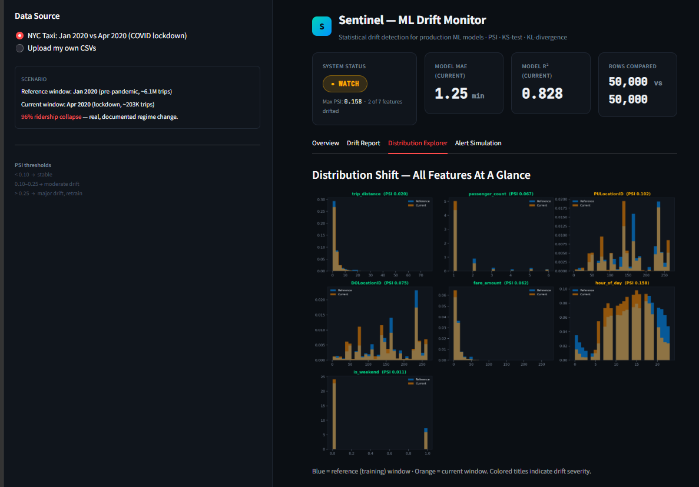

# Sentinel — Statistical ML Model Drift Monitor
[](https://github.com/divyadhotre/sentinel-ml-drift-monitor/actions/workflows/tests.yml)
[](LICENSE)
[](https://www.python.org/downloads/)
[](https://sentinel-ml-drift-monitor-rl9w2flgrtxpjf4qdndu99.streamlit.app)
[](coverage.svg)


**Every deployed ML model eventually sees data that no longer looks like what it was trained on — and nothing tells you when that happens. Sentinel does.**

**[Try the live demo →](https://sentinel-ml-drift-monitor-rl9w2flgrtxpjf4qdndu99.streamlit.app)** — upload your own data and see it work instantly, no setup required.


Point it at any two tabular datasets — your model's training data and today's data — and it tells you: has the input data drifted, is it the kind of drift that actually matters, has the underlying relationship between inputs and outcomes changed, and should you retrain.



```bash
pip install -e .
sentinel monitor --reference old_data.csv --current new_data.csv --features col1,col2,col3 --target outcome_col
```

---

## Table of Contents

- [The Problem](#the-problem)
- [Proof It Works: A Real, Documented Case Study](#proof-it-works-a-real-documented-case-study)
- [Try It On Your Own Data](#try-it-on-your-own-data)
- [What Sentinel Actually Does](#what-sentinel-actually-does)
- [How Sentinel Compares](#how-sentinel-compares)
- [Architecture](#architecture)
- [Key Results (Case Study)](#key-results-case-study)
- [Dashboard](#dashboard)
- [Installation & Usage](#installation--usage)
- [Reproducing the NYC Taxi Case Study](#reproducing-the-nyc-taxi-case-study)
- [Explicitly Out of Scope](#explicitly-out-of-scope)
- [Limitations](#limitations)
- [Data Source](#data-source)
- [License](#license)

---

## The Problem

A model trained today is trained on a snapshot of the world. Three months from now, the world has moved on — customer behavior shifts, seasons change, unexpected events happen — but the model has no idea. It keeps making confident predictions on data it was never designed for, and quietly gets worse, until someone eventually notices the business impact.

Drift monitoring is standard practice at large tech companies — Evidently AI, WhyLabs, NannyML, and Arize AI all exist because of this exact problem — but is rarely built by teams outside that scale. Sentinel is a from-scratch implementation of the core statistical primitives behind those tools, built to deeply understand, and prove, how they actually work.

---

## Proof It Works: A Real, Documented Case Study

To validate that Sentinel isn't just "runs without crashing," it needed to be tested against a case with **known ground truth** — a real event where drift definitely happened, so detection could be checked against reality rather than assumption.

**The case:** NYC Yellow Taxi trip data, January 2020 (pre-pandemic) vs April 2020 (COVID-19 lockdown) — ridership collapsed **96%** (6,405,008 → 238,073 trips), one of the most extreme, well-documented disruptions to urban transportation in recent history.

> **Finding:** core trip mechanics — distance and fare — remained statistically stable. The real drift was *behavioral*: when (`hour_of_day`) and where (`PULocationID`) people traveled shifted, while how far and how much they paid did not. A naive "did accuracy drop?" check would have missed this distinction entirely — it's only visible through feature-level statistical monitoring, which is exactly what Sentinel does.

This case study lives in `src/` and `notebooks/` as a full, reproducible example — but **Sentinel itself is generic**: the `sentinel/` package underneath makes no reference to taxis, dates, or any specific domain. See below.

---

## Try It On Your Own Data

```python
from sentinel import SentinelMonitor

result = SentinelMonitor(
    reference_df=old_data,            # any pandas DataFrame
    current_df=new_data,              # any pandas DataFrame
    feature_columns=["col1", "col2", "col3"],
    target_column="outcome",          # optional -- enables concept drift + performance checks
    model=my_trained_sklearn_model,   # optional -- enables live performance evaluation
).run()

print(result.status)        # "OK" / "WATCH" / "ALERT"
print(result.drift_report)  # full PSI / KS-test / KL-divergence / naive z-score table
print(result.summary)       # plain-English verdict
```

Or from the command line, no Python required:
```bash
sentinel monitor --reference old.csv --current new.csv --features distance,hour,price --target duration
```

Check multiple models in one command via a config file:
```bash
sentinel monitor-all --config sentinel_config.yaml
```
```yaml
jobs:
  - name: taxi-duration-model
    reference: data/processed/taxi_training_era.csv
    current: data/processed/taxi_current_era.csv
    features: [trip_distance, passenger_count, PULocationID, DOLocationID, fare_amount, hour_of_day, is_weekend]
    target: trip_duration_min
  - name: another-model
    reference: path/to/old.csv
    current: path/to/new.csv
    features: [feature_a, feature_b]
    target: outcome_col
```

> **Windows note:** if the `sentinel` command is blocked by an Application Control policy, use `python -m sentinel.cli monitor ...` instead — identical behavior, different entry point.

---

## What Sentinel Actually Does

| Capability | Description | Where |
|---|---|---|
| **Data drift detection** | PSI, KS-test, KL-divergence — implemented from their statistical formulas, not a black-box library call | `sentinel/metrics.py` |
| **Naive-baseline comparison** | Proves *why* PSI/KS/KL matter: a same-mean-different-shape distribution fools a naive z-score (0.05, "fine") but is correctly flagged by PSI (0.61, "major drift") | `sentinel/metrics.py`, `tests/test_drift_metrics.py` |
| **Concept drift detection** | Checks whether the *relationship* between inputs and target changed — not just the inputs — by training per-era models and comparing feature importances and correlations | `sentinel/concept_drift.py` |
| **Label-free performance estimation** | Estimates model accuracy on new data **without needing true labels**, using a secondary model trained to predict expected error — the same core idea NannyML built a company around | `sentinel/performance.py` |
| **Rolling-window monitoring** | Splits time-stamped data into periods (e.g. weekly) and tracks drift accumulation over time, with automatic filtering of partial/unreliable boundary periods | `sentinel/rolling.py` |
| **Real Slack alerting** | Posts actual webhook notifications to Slack when status crosses WATCH/ALERT — not a UI mockup | `sentinel/alerting.py` |
| **Multi-model batch monitoring** | One config file + one command checks several models at once, with per-job error isolation | `sentinel/config.py`, `sentinel/batch.py` |
| **Interactive dashboard** | KPIs, drift table, distribution comparison grid, live alert preview | `app/streamlit_app.py` |
| **Robustness validation** | A 20-seed × 8-magnitude sensitivity sweep proving detection reliability scales predictably, not just works on one lucky example | `notebooks/05_robustness_analysis.ipynb` |

---

## How Sentinel Compares

| Feature | Evidently AI | WhyLabs | NannyML | Arize AI | **Sentinel** |
|---|---|---|---|---|---|
| Data drift detection (PSI/KS/KL) | Yes | Yes | Yes | Yes | Yes |
| Statistics implemented from formulas (not black-box) | No | No | No | No | **Yes** |
| Concept drift detection | Partial | Partial | Yes (specialty) | Yes | Yes |
| Label-free performance estimation | No | Partial | Yes (specialty) | Partial | Yes |
| Naive-baseline comparison (proving *why* PSI beats a mean-check) | No | No | No | No | **Yes** |
| Robustness/sensitivity validation | No | No | No | No | **Yes** |
| Installable package + CLI | Yes | Yes | Yes | N/A (SaaS) | Yes |
| Real alerting (Slack) | Yes | Yes | Partial | Yes | Yes |
| Multi-model batch checks | Yes | Yes | Yes | Yes | Yes (lightweight) |
| Streaming/continuous monitoring | Yes | Yes | Yes | Yes | Rolling-window (batch), not live streaming |
| Enterprise auth/compliance | N/A | Yes | N/A | Yes | Not the goal (see [Explicitly Out of Scope](#explicitly-out-of-scope)) |

**Honest positioning:** Sentinel isn't trying to replace these tools — it's a from-scratch reimplementation of their core statistical primitives, built to deeply understand what they abstract away, plus two things not commonly exposed by any of them: explicit proof that the drift metrics outperform a naive baseline, and a systematic robustness study proving detection reliability across many scenarios rather than one example.

---

## Architecture

```
sentinel/                  <- the installable, generic package (the actual tool)
├── metrics.py               PSI, KS-test, KL-divergence, naive z-score
├── concept_drift.py         relationship-level drift detection
├── performance.py           label-free performance estimation
├── rolling.py                time-windowed drift monitoring
├── alerting.py                real Slack webhook integration
├── config.py / batch.py        multi-model batch monitoring
├── core.py                      SentinelMonitor -- the main API
└── cli.py                        command-line interface

src/                        <- the NYC Taxi case study (proves the package works)
├── data_loader.py           real data cleaning + feature engineering
├── data_simulation.py       synthetic controlled testbed (robustness notebook)
├── model.py                 baseline Random Forest training/evaluation
└── performance_estimation.py  case-study wrapper around sentinel/performance.py

app/streamlit_app.py        <- interactive dashboard, built on the sentinel package
notebooks/                  <- EDA, results, and robustness analysis
tests/ + .github/workflows/ <- automated tests, run on every push (see badge above)
```

---

## Key Results (Case Study)

| Metric | Jan 2020 (reference) | Apr 2020 (current) | Change |
|---|---|---|---|
| Total trips (raw) | 6,405,008 | 238,073 | **-96%** |
| Model MAE | 1.10 min (hold-out) | 1.25 min | +14% |
| Model R² | 0.910 | 0.828 | -9% |
| `hour_of_day` PSI | -- | 0.158 | Moderate drift |
| `PULocationID` PSI | -- | 0.102 | Moderate drift |
| `trip_distance` PSI | -- | 0.020 | Stable |
| `fare_amount` PSI | -- | 0.063 | Stable |
| Concept drift check | -- | -- | **None detected** -- relationship held steady |
| Label-free performance estimate | 0.93 min (estimated) | 1.25 min (actual) | 25.2% estimate error |
| Rolling-window trend (Apr, weekly) | 0.00 -> 0.11 | -- | Gradual accumulation visible before a full-window comparison would show it |

*(Full per-feature table in `reports/drift_report.csv`; rolling trend in `reports/rolling_drift_timeline.csv`.)*

---

## Dashboard

An interactive Streamlit dashboard with four views — Overview (KPIs + key finding), Drift Report (full statistical table, downloadable), Distribution Explorer (all features at a glance), and Alert Simulation (live preview of the Slack message format).

```bash
streamlit run app/streamlit_app.py
```



---

## Tech Stack

Python, pandas, NumPy, scikit-learn, SciPy, Matplotlib, Streamlit, Jupyter, pytest + GitHub Actions (CI), PyYAML, Requests (real Slack webhooks)

**What Sentinel can monitor:** any numeric feature space, including precomputed embeddings (e.g. sentence-transformer text embeddings or CNN image feature vectors) — Sentinel does not generate embeddings itself, it detects drift in whatever numeric representation you provide it.

> **Windows note:** if `pip`, `pytest`, or `sentinel` commands are blocked by an Application Control policy, prefix them with `python -m` instead (e.g., `python -m pip install ...`, `python -m pytest ...`) — same behavior, routed through the trusted Python interpreter instead of a generated `.exe` launcher.
---

## Installation & Usage

```bash
git clone https://github.com/divyadhotre/sentinel-ml-drift-monitor.git
cd sentinel-ml-drift-monitor
python -m venv venv
venv\Scripts\activate          # Windows
pip install -e .
```

Then use the Python API or CLI as shown in [Try It On Your Own Data](#try-it-on-your-own-data) above, on **any** dataset — no case-study data required.

### Real Slack Alerts (optional)

```python
from sentinel.alerting import send_slack_alert
send_slack_alert(result)  # reads webhook URL from SENTINEL_SLACK_WEBHOOK env var
```
Set up a free webhook at [api.slack.com/apps](https://api.slack.com/apps) → Incoming Webhooks, then:
```bash
export SENTINEL_SLACK_WEBHOOK="https://hooks.slack.com/services/..."   # Mac/Linux
$env:SENTINEL_SLACK_WEBHOOK = "https://hooks.slack.com/services/..."   # Windows PowerShell
```

---

## Reproducing the NYC Taxi Case Study

**1. Download the real data** from [NYC TLC Trip Record Data](https://www.nyc.gov/site/tlc/about/tlc-trip-record-data.page) — under **2020**, get **Yellow Taxi Trip Records (Parquet)** for **January** and **April**:
```
data/raw/yellow_tripdata_2020-01.parquet
data/raw/yellow_tripdata_2020-04.parquet
```

**2. Run the case-study pipeline in order:**
```bash
python src/data_simulation.py          # optional: generates the synthetic robustness testbed
python src/data_loader.py              # cleans real taxi data
python src/model.py                    # trains + evaluates the baseline model
python src/drift_metrics.py            # statistical drift report (legacy path; sentinel/metrics.py is canonical)
python src/concept_drift.py            # relationship-level drift check
python src/performance_estimation.py   # label-free performance estimation
python run_rolling_analysis.py         # week-by-week drift trend
python src/monitor.py                  # combined OK/WATCH/ALERT verdict
```

**3. Launch the dashboard:**
```bash
streamlit run app/streamlit_app.py
```

**4. Explore the notebooks** in `notebooks/` (select the project's `venv` as the Jupyter kernel).

---

## Explicitly Out of Scope

- **Not enterprise infrastructure.** No authentication, multi-tenancy at scale, or compliance certifications (SOC2/HIPAA). Built for single-team, single-or-few-model monitoring.
- **Not a replacement for Evidently AI / NannyML / WhyLabs / Arize AI.** See [How Sentinel Compares](#how-sentinel-compares) for the honest positioning.
- **Not full streaming infrastructure.** Rolling-window mode processes historical time-stamped data in batches, not a live, continuously-arriving stream (e.g., Kafka).

Declaring these boundaries explicitly is intentional — the goal is demonstrating deep understanding of ML monitoring fundamentals, not competing with funded, years-in-development commercial platforms.

## Limitations

- **Case-study sampling:** the taxi case study samples to 50,000 rows per era for iteration speed; the generic `sentinel/` package itself has no such limit.
- **Extreme case by design:** COVID-19 was chosen deliberately as a large, well-documented event to validate methodology under known ground truth. The robustness notebook's sensitivity sweep additionally tests detection reliability across a *range* of drift magnitudes, not just this extreme case.
- **Rolling-window mode requires a date column**, and currently supports pandas-style frequency strings (daily/weekly/monthly) rather than arbitrary custom windows.
- **Single model family evaluated in the case study** (Random Forest); a linear baseline comparison is scaffolded in `model.py` (`model_type="linear"`) but not run by default.

## Data Source

[NYC Taxi & Limousine Commission — Trip Record Data](https://www.nyc.gov/site/tlc/about/tlc-trip-record-data.page) (public, free, official government source)

## License

[MIT](LICENSE) — free to use, modify, and build on.
