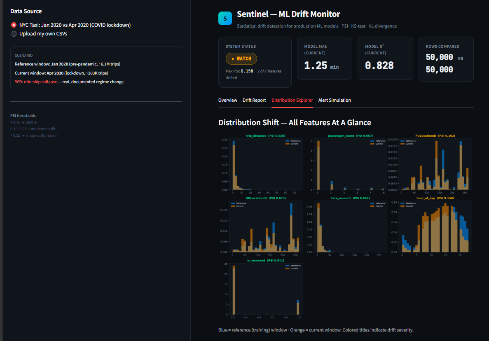

# Sentinel — Statistical ML Model Drift Monitor

[](https://github.com/divyadhotre/sentinel-ml-drift-monitor/actions/workflows/tests.yml)
[](coverage.svg)
[](LICENSE)
[](https://www.python.org/downloads/)
[](https://sentinel-ml-drift-monitor-rl9w2flgrtxpjf4qdndu99.streamlit.app)

**Every deployed ML model eventually sees data that no longer looks like what it was trained on — and nothing tells you when that happens. Sentinel does.**

**[Try the live demo →](https://sentinel-ml-drift-monitor-rl9w2flgrtxpjf4qdndu99.streamlit.app)** — upload your own data and see it work instantly, no setup required.

*(Free-tier hosting sleeps after inactivity — if you see a "Zzzz" screen, click "Yes, get this app back up!" and wait ~30 seconds.)*


Point it at any two tabular datasets — your model's training data and today's data — and it tells you: has the input data drifted, has the *relationship between* features drifted (even if none look different alone), has the underlying relationship between inputs and outcomes changed, and should you retrain.

```bash
pip install -e .
sentinel monitor --reference old_data.csv --current new_data.csv --features col1,col2,col3 --target outcome_col
```

---

## Table of Contents

- [The Problem](#the-problem)
- [Proof It Works: Two Independent Real-World Case Studies](#proof-it-works-two-independent-real-world-case-studies)
- [Try It On Your Own Data](#try-it-on-your-own-data)
- [What Sentinel Actually Does](#what-sentinel-actually-does)
- [How Sentinel Compares](#how-sentinel-compares)
- [Architecture](#architecture)
- [Key Results](#key-results)
- [Dashboard](#dashboard)
- [Installation & Usage](#installation--usage)
- [Reproducing the Case Studies](#reproducing-the-case-studies)
- [Explicitly Out of Scope](#explicitly-out-of-scope)
- [Limitations](#limitations)
- [Data Sources](#data-sources)
- [License](#license)

---

## The Problem

A model trained today is trained on a snapshot of the world. Weeks or months later, the world has moved on — customer behavior shifts, seasons change, unexpected events happen — but the model has no idea. It keeps making confident predictions on data it was never designed for, and quietly gets worse, until someone eventually notices the business impact.

Drift monitoring is standard practice at large tech companies — Evidently AI, WhyLabs, NannyML, and Arize AI all exist because of this exact problem — but is rarely built by teams outside that scale. Sentinel is a from-scratch implementation of the core statistical primitives behind those tools, built to deeply understand, and prove, how they actually work.

---

## Proof It Works: Two Independent Real-World Case Studies

A monitoring tool is only trustworthy if it's been tested against reality, more than once, in more than one domain.

### Case Study 1: NYC Yellow Taxi — A Sudden Regime Change

January 2020 (pre-pandemic) vs April 2020 (COVID-19 lockdown) — ridership collapsed **96%** (6,405,008 → 238,073 trips), one of the most extreme, well-documented disruptions to urban transportation in recent history.

> **Finding:** core trip mechanics — distance and fare — remained statistically stable. The real drift was *behavioral*: when (`hour_of_day`) and where (`PULocationID`) people traveled shifted, while how far and how much they paid did not.

### Case Study 2: NYC Citibike — A Gradual Seasonal Shift, and a Real Mistake Caught

January vs July 2020 bike-share data — a completely different domain, a different data source, and a gradual shift rather than a sudden shock.

**The first attempt at this test included a mistake, documented deliberately rather than hidden:** the initial feature set included `bikeid` — a bike's identifier number — which showed the single largest PSI (6.27) of any column. This is a real, textbook error: an identifier has no meaningful "distribution" to compare, and treating it as a continuous feature produces a technically real but practically meaningless statistic. Once removed, the result told a coherent story instead: `tripduration` dropped from ~31 minutes to ~9 minutes (major drift, plausible for more short casual summer rides), station coordinates showed moderate seasonal drift, and station IDs stayed stable.

Full walkthrough, including the mistake and correction, in [`notebooks/02_citibike_validation.ipynb`](notebooks/02_citibike_validation.ipynb).

**Both case studies use the exact same, unmodified `sentinel` package** — nothing was written specifically for either dataset.

---

## Try It On Your Own Data

```python
from sentinel import SentinelMonitor

result = SentinelMonitor(
    reference_df=old_data,            # any pandas DataFrame
    current_df=new_data,              # any pandas DataFrame
    feature_columns=["col1", "col2", "col3"],
    target_column="outcome",          # optional -- enables concept drift + performance checks
    model=my_trained_sklearn_model,   # optional -- enables live performance evaluation
).run()

print(result.status)        # "OK" / "WATCH" / "ALERT"
print(result.drift_report)  # full PSI / KS-test / KL-divergence / naive z-score table
print(result.summary)       # plain-English verdict
```

Or from the command line, no Python required:
```bash
sentinel monitor --reference old.csv --current new.csv --features distance,hour,price --target duration
```

Check multiple models in one command via a config file:
```bash
sentinel monitor-all --config sentinel_config.yaml
```

Check for correlation-level drift between features (catches shifts univariate checks miss entirely):
```python
from sentinel.multivariate import detect_multivariate_drift

result = detect_multivariate_drift(old_data, new_data, feature_columns=["col1", "col2", "col3"])
print(result["domain_classifier_auc"], result["verdict"])
```

No pre-trained model? Sentinel can train one on the spot for a quick sanity check:
```python
from sentinel.baseline import train_quick_baseline, evaluate_quick_baseline

baseline = train_quick_baseline(old_data, feature_columns=["col1", "col2"], target_column="outcome")
metrics = evaluate_quick_baseline(baseline, new_data, target_column="outcome")
# ID-like columns are auto-excluded; results always carry a "not a validated model" label
```

> **Windows note:** If `pip`, `pytest`, `sentinel`, or `streamlit` commands are blocked by an Application Control policy, prefix them with `python -m` instead (e.g., `python -m streamlit run app/streamlit_app.py`) — same behavior, routed through the trusted Python interpreter instead of a generated `.exe` launcher.

---

## What Sentinel Actually Does

| Capability | Description | Where |
|---|---|---|
| **Data drift detection** | PSI, KS-test, KL-divergence — implemented from their statistical formulas, not a black-box library call | `sentinel/metrics.py` |
| **Naive-baseline comparison** | Proves *why* PSI/KS/KL matter: a same-mean-different-shape distribution fools a naive z-score (0.05, "fine") but is correctly flagged by PSI (0.61, "major drift") | `sentinel/metrics.py`, `tests/test_drift_metrics.py` |
| **Concept drift detection** | Checks whether the *relationship* between inputs and target changed — not just the inputs — by training per-era models and comparing feature importances and correlations | `sentinel/concept_drift.py` |
| **Multivariate drift detection** | Trains a "domain classifier" to distinguish reference vs. current rows using only the features — catches correlation/relationship shifts between features that are invisible to every per-feature check (proven on a case where two features individually show zero drift, but AUC = 0.98) | `sentinel/multivariate.py` |
| **Label-free performance estimation** | Estimates model accuracy on new data **without needing true labels**, using a secondary model trained to predict expected error — the same core idea NannyML built a company around | `sentinel/performance.py` |
| **Quick Baseline Model** | Opt-in, honestly-labeled ("NOT AutoML") baseline training for datasets with no pre-trained model — auto-excludes ID-like columns, reports an honest same-era holdout comparison against current-data performance, gated on minimum data quality | `sentinel/baseline.py` |
| **Rolling-window monitoring** | Splits time-stamped data into periods (e.g. weekly) and tracks drift accumulation over time, with automatic filtering of partial/unreliable boundary periods | `sentinel/rolling.py` |
| **Real Slack alerting** | Posts actual webhook notifications to Slack when status crosses WATCH/ALERT — not a UI mockup | `sentinel/alerting.py` |
| **Multi-model batch monitoring** | One config file + one command checks several models at once, with per-job error isolation | `sentinel/config.py`, `sentinel/batch.py` |
| **Interactive dashboard** | KPIs, drift table, distribution comparison grid, live alert preview, dynamic column selection for any uploaded CSV | `app/streamlit_app.py` |
| **Robustness validation** | A 20-seed × 8-magnitude sensitivity sweep proving detection reliability scales predictably, not just works on one lucky example | `notebooks/05_robustness_analysis.ipynb` |

---

## How Sentinel Compares

| Feature | Evidently AI | WhyLabs | NannyML | Arize AI | **Sentinel** |
|---|---|---|---|---|---|
| Data drift detection (PSI/KS/KL) | Yes | Yes | Yes | Yes | Yes |
| Statistics implemented from formulas (not black-box) | No | No | No | No | **Yes** |
| Concept drift detection | Partial | Partial | Yes (specialty) | Yes | Yes |
| Multivariate/correlation drift detection | Partial | No | Partial | Partial | **Yes** |
| Label-free performance estimation | No | Partial | Yes (specialty) | Partial | Yes |
| Naive-baseline comparison (proving *why* PSI beats a mean-check) | No | No | No | No | **Yes** |
| Robustness/sensitivity validation | No | No | No | No | **Yes** |
| Installable package + CLI | Yes | Yes | Yes | N/A (SaaS) | Yes |
| Real alerting (Slack) | Yes | Yes | Partial | Yes | Yes |
| Multi-model batch checks | Yes | Yes | Yes | Yes | Yes (lightweight) |
| Streaming/continuous monitoring | Yes | Yes | Yes | Yes | Rolling-window (batch), not live streaming |
| Enterprise auth/compliance | N/A | Yes | N/A | Yes | Not the goal (see [Explicitly Out of Scope](#explicitly-out-of-scope)) |

**Honest positioning:** Sentinel isn't trying to replace these tools — it's a from-scratch reimplementation of their core statistical primitives, built to deeply understand what they abstract away, plus things not commonly exposed by any of them: explicit proof that the drift metrics outperform a naive baseline, a systematic robustness study, and a domain-classifier-based multivariate check with a documented, reproducible proof case.

---

## Architecture

```
sentinel/                  <- the installable, generic package (the actual tool)
├── metrics.py               PSI, KS-test, KL-divergence, naive z-score
├── concept_drift.py         relationship-level (feature-to-target) drift detection
├── multivariate.py          domain-classifier multivariate (feature-to-feature) drift detection
├── performance.py           label-free performance estimation
├── baseline.py               Quick Baseline Model: ID-detection, holdout comparison, safety gates
├── rolling.py                 time-windowed drift monitoring
├── alerting.py                 real Slack webhook integration
├── config.py / batch.py         multi-model batch monitoring
├── core.py                       SentinelMonitor -- the main API
└── cli.py                         command-line interface

src/                        <- case studies (prove the package works on real data)
├── data_loader.py           NYC Taxi data cleaning + feature engineering
├── data_simulation.py       synthetic controlled testbed (robustness notebook)
├── model.py                 baseline Random Forest training/evaluation
└── performance_estimation.py  case-study wrapper around sentinel/performance.py

app/streamlit_app.py        <- interactive dashboard, built on the sentinel package
notebooks/
├── 01_eda_and_results.ipynb        NYC Taxi case study
├── 02_citibike_validation.ipynb    NYC Citibike case study (incl. the bikeid correction)
└── 05_robustness_analysis.ipynb    naive-vs-PSI demo + sensitivity sweep
tests/ + .github/workflows/  <- 40+ automated tests, 92% coverage, run on every push
```

---

## Key Results

| Case Study | Metric | Reference | Current | Change |
|---|---|---|---|---|
| **NYC Taxi** | Total trips (raw) | 6,405,008 | 238,073 | **-96%** |
| NYC Taxi | Model MAE | 1.10 min | 1.25 min | +14% |
| NYC Taxi | `hour_of_day` PSI | — | 0.158 | Moderate drift |
| NYC Taxi | Concept drift check | — | — | **None detected** — relationship held steady |
| NYC Taxi | Label-free performance estimate | 0.93 min (est.) | 1.25 min (actual) | 25.2% estimate error |
| **NYC Citibike** | `tripduration` (before `bikeid` fix) | PSI 1.17 | — | Correctly flagged |
| NYC Citibike | `bikeid` (the mistake) | PSI 6.27 | — | Meaningless — identifier, not a measurement |
| NYC Citibike | `tripduration` (after fix) | ~31 min avg | ~9 min avg | Major, plausible seasonal drift |
| **Synthetic proof** | Multivariate AUC, correlation flip | Univariate PSI: 0.003, 0.004 | AUC: 0.977 | Multivariate catch, univariate miss |

*(Full tables in `reports/drift_report.csv` and the respective notebooks.)*

---

## Dashboard

An interactive Streamlit dashboard with four views — Overview (KPIs, concept drift, key finding), Drift Report (full statistical table, downloadable), Distribution Explorer (all features at a glance), and Alert Simulation (live preview of the Slack message format) — plus dynamic column selection and an opt-in Quick Baseline Model for any uploaded dataset.

```bash
streamlit run app/streamlit_app.py
```



---

## Tech Stack

Python, pandas, NumPy, scikit-learn, SciPy, Matplotlib, Streamlit, Jupyter, pytest + pytest-cov + GitHub Actions (CI), PyYAML, Requests (real Slack webhooks)

**What Sentinel can monitor:** any numeric feature space, including precomputed embeddings (e.g. sentence-transformer text embeddings or CNN image feature vectors) — Sentinel does not generate embeddings itself, it detects drift in whatever numeric representation you provide it.

---

## Installation & Usage

```bash
git clone https://github.com/divyadhotre/sentinel-ml-drift-monitor.git
cd sentinel-ml-drift-monitor
python -m venv venv
venv\Scripts\activate          # Windows
pip install -e .
```

Then use the Python API or CLI as shown in [Try It On Your Own Data](#try-it-on-your-own-data) above, on **any** dataset — no case-study data required.

### Real Slack Alerts (optional)

Copy `.env.example` to `.env` and fill in your webhook, or set it directly:
```python
from sentinel.alerting import send_slack_alert
send_slack_alert(result)  # reads webhook URL from SENTINEL_SLACK_WEBHOOK env var
```
Set up a free webhook at [api.slack.com/apps](https://api.slack.com/apps) → Incoming Webhooks.

---

## Reproducing the Case Studies

**NYC Taxi:** download **Yellow Taxi Trip Records (Parquet)** for **January** and **April 2020** from [NYC TLC Trip Record Data](https://www.nyc.gov/site/tlc/about/tlc-trip-record-data.page), place at `data/raw/yellow_tripdata_2020-01.parquet` and `...-04.parquet`, then:
```bash
python src/data_loader.py
python src/model.py
python src/drift_metrics.py
python src/concept_drift.py
python src/performance_estimation.py
python run_rolling_analysis.py
python src/monitor.py
```

**NYC Citibike:** download January and July 2020 trip data from [Citibike System Data](https://s3.amazonaws.com/tripdata/index.html), place at `data/raw/JC-202001-citibike-tripdata.csv` and `JC-202007-citibike-tripdata.csv`, then run `notebooks/02_citibike_validation.ipynb`.

**Dashboard:** `streamlit run app/streamlit_app.py`

---

## Explicitly Out of Scope

- **Not enterprise infrastructure.** No authentication, multi-tenancy at scale, or compliance certifications (SOC2/HIPAA). Built for single-team, single-or-few-model monitoring.
- **Not a replacement for Evidently AI / NannyML / WhyLabs / Arize AI.** See [How Sentinel Compares](#how-sentinel-compares) for the honest positioning.
- **Not full streaming infrastructure.** Rolling-window mode processes historical time-stamped data in batches, not a live, continuously-arriving stream (e.g., Kafka).
- **The Quick Baseline Model is explicitly not AutoML.** One fixed algorithm (Random Forest), no hyperparameter tuning, no model comparison — a convenience sanity-check, always labeled as such.

## Limitations

- **Case-study sampling:** the taxi case study samples to 50,000 rows per era for iteration speed; the generic `sentinel/` package itself has no such limit.
- **Extreme case by design:** COVID-19 was chosen deliberately as a large, well-documented event to validate methodology under known ground truth; the Citibike case study and the robustness notebook's sensitivity sweep both test smaller/gradual drift instead.
- **Rolling-window mode requires a date column**, and currently supports pandas-style frequency strings rather than arbitrary custom windows.
- **The multivariate domain classifier** is a real, working implementation, but like the Quick Baseline Model, is a single fixed algorithm (Random Forest) without tuning — a genuine signal, not a definitive one.

## Data Sources

- [NYC Taxi & Limousine Commission — Trip Record Data](https://www.nyc.gov/site/tlc/about/tlc-trip-record-data.page) (public, official government source)
- [Citibike System Data](https://s3.amazonaws.com/tripdata/index.html) (public, official Citibike source)

## License

[MIT](LICENSE) — free to use, modify, and build on.
